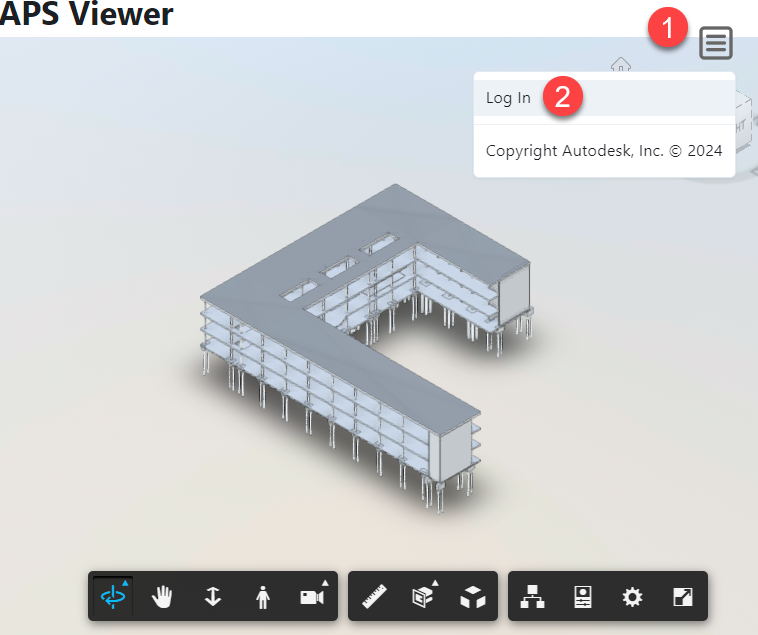

# Autodesk Platform Services Viewer
This is a demo web app that demonstrates how to create an APS Model Viewer using the [Reflex](https://reflex.dev/) framework using only Python.

The project leverages APS endpoints to retrieve a three-legged token.

# How to Use It
1. Clone the project
2. Create an app on [aps.autodesk.com](https://aps.autodesk.com/)
3. Copy the Client Id and the Client Secret and Redirect URL in the `.env` file in the same folder where `aps.py` is located.

    The `.env` file should look like this:

   `CONSUMER_KEY=<Client Id>`

   `CONSUMER_SECRET=<Client Secret>`

   `REDIRECT_URI=<Redirect Url>`
4. Create a virtual environment and install the dependencies (e.g., `pip install -r requirements.txt`)
5. From the terminal in the project folder launch `reflex init` to initialize the reflex project and select a blank template
6. When completed launch reflex run and wait until you receive confirmation that the app is running
7. Open the browser and navigate to `http://localhost:3000` to see the app
8. Press on the menu icon on the top right corner and select the `Log In` option to authenticate your Autodesk account

9. You can pass a different derivatives urn in the `shared_reflex_viewer.py` as an argument of the `create_viewer()` function.

## NOTE
If the viewer does not load, chances are the token needs to be refreshed.

Try to close al the browser windows to clean the cache and authenticate again.

# License
Author: paolo.serra@autodesk.com

Copyright (c) 2024 Autodesk, Inc. All rights reserved.

Licensed under the Apache License, Version 2.0 (the "License").
You may not use this file except in compliance with the License.
You may obtain a copy of the License at
  http://www.apache.org/licenses/LICENSE-2.0

Unless required by applicable law or agreed to in writing, software
distributed under the License is distributed on an "AS IS" BASIS,
WITHOUT WARRANTIES OR CONDITIONS OF ANY KIND, either express or
implied.  See the License for the specific language governing
permissions and limitations under the License.

# Dependencies
* reflex 0.4+
* python-decouple
* requests

